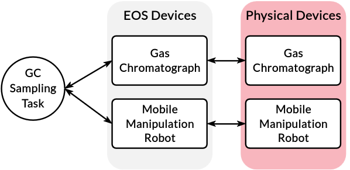

Devices
=======
In EOS, a device is an abstraction for a physical or virtual apparatus.
A device is used by one or more tasks to run some processes.
Each device in EOS is managed by a dedicated process which is created when a laboratory definition is loaded.
This process is usually implemented as a server and tasks call various functions from it.
For example, there could be a device called "magnetic mixer", which communicates with a physical magnetic mixer via
serial and provides functions such as ``start``, ``stop``, ``set_time`` and ``set_speed``.

In the figure above, we illustrate an example of devices and a task that uses these devices.
The task in this example is Gas Chromatography (GC) sampling, which is implemented with a GC and a mobile manipulation
robot for automating the sample injection with a syringe.
Both the GC and the robot are physical devices, and each has a device implementation in EOS, which runs as a persistent
process.
Then, the GC Sampling task uses both of the EOS devices to automate the sample injection process.

Most often, an EOS device will represent a physical device in the lab.
But this need not always be the case. A device in EOS can be used to represent anything that needs persistent state
throughout one or more experiments.
This could be an AI module that records inputs given to it.
Remember that a device in EOS is a persistent process.

Device Implementation
---------------------
* Devices are implemented in the `devices` subdirectory inside an EOS package
* Each device has its own subfolder (e.g., devices/magnetic_mixer)
* There are two key files per device: ``device.yml`` and ``device.py``

YAML File (device.yml)
~~~~~~~~~~~~~~~~~~~~~~
* Specifies the device type, desc, and initialization parameters
* The same implementation can be used for multiple devices of the same type
* Initialization parameters can be overridden in laboratory definition

Below is an example device YAML file for a magnetic mixer:

:bdg-primary:`device.yml`

.. code-block:: yaml

    type: magnetic_mixer
    desc: Magnetic mixer for mixing the contents of a container

    init_parameters:
      port: 5004

Python File (device.py)
~~~~~~~~~~~~~~~~~~~~~~~
* Implements device functionality
* All devices implementations must inherit from ``BaseDevice``

Below is a example implementation of a magnetic mixer device:

:bdg-primary:`device.py`

.. code-block:: python

    from typing import Any

    from eos.containers.entities.container import Container
    from eos.devices.base_device import BaseDevice
    from user.eos_examples.color_lab.common.device_client import DeviceClient

    class MagneticMixer(BaseDevice):
        async def _initialize(self, init_parameters: dict[str, Any]) -> None:
            port = int(init_parameters["port"])
            self.client = DeviceClient(port)
            self.client.open_connection()

        async def _cleanup(self) -> None:
            self.client.close_connection()

        async def _report(self) -> dict[str, Any]:
            return {}

        def mix(self, container: Container, mixing_time: int, mixing_speed: int) -> Container:
            result = self.client.send_command("mix", {"mixing_time": mixing_time, "mixing_speed": mixing_speed})
            if result:
                container.metadata["mixing_time"] = mixing_time
                container.metadata["mixing_speed"] = mixing_speed

            return container

Let's walk through this example code:

There are functions required in every device implementation:

#. **_initialize**

   * Called when device process is created
   * Should set up necessary resources (e.g., serial connections)

#. **_cleanup**

   * Called when the device process is terminated
   * Should clean up any resources created by the device process (e.g., serial connections)

#. **_report**

   * Should return any data needed to determine the state of the device (e.g., status and feedback)

The magnetic mixer device also has the function ``mix`` for implementing the mixing operation.
This function will be called by a task to mix the contents of a container.
The ``mix`` function:

* Sends a command to lower-level driver with a specified mixing time and speed to operate the magnetic mixer
* Updates container metadata with mixing details

Device State Management with Dataclasses
---------------------------------------
When a device needs to keep track of state between calls, a convenient way is to
store that state in a :mod:`dataclasses.dataclass`.  The dataclass instance can be
stored as an attribute of the device and exposed through device methods so tasks
or external processes can query or update it.

Here is a minimal example device that counts how many times it has been called:

:bdg-primary:`device.py`

.. code-block:: python

    from dataclasses import dataclass
    from typing import Any

    from eos.devices.base_device import BaseDevice

    @dataclass
    class CounterState:
        value: int = 0

    class StatefulCounter(BaseDevice):
        async def _initialize(self, init_parameters: dict[str, Any]) -> None:
            self.state = CounterState(value=int(init_parameters.get("initial", 0)))

        async def _cleanup(self) -> None:
            pass

        async def _report(self) -> dict[str, Any]:
            return {"value": self.state.value}

        def increment(self, amount: int = 1) -> int:
            self.state.value += amount
            return self.state.value

        def decrement(self, amount: int = 1) -> int:
            self.state.value -= amount
            return self.state.value

        def get_state(self) -> dict[str, Any]:
            return {"value": self.state.value}

        def set_state(self, value: int) -> None:
            self.state.value = int(value)

        def apply_operations(self, ops: list[dict[str, int]]) -> int:
            for op in ops:
                action = op.get("action")
                if action == "increment":
                    self.increment(int(op.get("amount", 1)))
                elif action == "decrement":
                    self.decrement(int(op.get("amount", 1)))
                elif action == "set":
                    self.set_state(int(op.get("value", 0)))
            return self.state.value

Interacting via the REST API
---------------------------
The current state of a device can be retrieved using the ``/labs/{lab_id}/device/{device_id}/report``
endpoint of the REST API. For the ``StatefulCounter`` example the request looks like:

.. code-block:: bash

    curl http://localhost:8070/api/labs/counter_lab/device/counter/report

To update the state externally, create a small task that calls ``increment`` on the device and
submit it through the ``/tasks`` API. Below is such a task:

:bdg-primary:`task.py`

.. code-block:: python

    from eos.tasks.base_task import BaseTask

    class IncrementCounter(BaseTask):
        async def _execute(
            self,
            devices: BaseTask.DevicesType,
            parameters: BaseTask.ParametersType,
            containers: BaseTask.ContainersType,
        ) -> BaseTask.OutputType:
            counter = devices.get_all_by_type("stateful_counter")[0]
            new_value = counter.increment(parameters["amount"])
            return {"value": new_value}, None, None

:bdg-primary:`task.yml`

.. code-block:: yaml

    type: Increment Counter
    desc: Increment a stateful counter device

    device_types:
      - stateful_counter

    input_parameters:
      amount:
        type: int
        unit: none
        value: 1
        desc: Amount to increment the counter

    output_parameters:
      value:
        type: int
        unit: none
        desc: The updated counter value

Submit the task with ``curl``:

.. code-block:: bash

    curl -X POST http://localhost:8070/api/tasks \
         -H "Content-Type: application/json" \
        -d '{
              "id": "inc1",
              "type": "Increment Counter",
              "devices": [{"lab_id": "counter_lab", "id": "counter"}],
              "input_parameters": {"amount": 5}
         }'

Similar tasks can be defined for decrementing or directly setting the counter
value.

:bdg-primary:`decrement_counter/task.py`

.. code-block:: python

    from eos.tasks.base_task import BaseTask

    class DecrementCounter(BaseTask):
        async def _execute(
            self,
            devices: BaseTask.DevicesType,
            parameters: BaseTask.ParametersType,
            containers: BaseTask.ContainersType,
        ) -> BaseTask.OutputType:
            counter = devices.get_all_by_type("stateful_counter")[0]
            new_value = counter.decrement(parameters["amount"])
            return {"value": new_value}, None, None

:bdg-primary:`decrement_counter/task.yml`

.. code-block:: yaml

    type: Decrement Counter
    desc: Decrement a stateful counter device

    device_types:
      - stateful_counter

    input_parameters:
      amount:
        type: int
        unit: none
        value: 1
        desc: Amount to decrement the counter

    output_parameters:
      value:
        type: int
        unit: none
        desc: The updated counter value

:bdg-primary:`set_counter/task.py`

.. code-block:: python

    from eos.tasks.base_task import BaseTask

    class SetCounter(BaseTask):
        async def _execute(
            self,
            devices: BaseTask.DevicesType,
            parameters: BaseTask.ParametersType,
            containers: BaseTask.ContainersType,
        ) -> BaseTask.OutputType:
            counter = devices.get_all_by_type("stateful_counter")[0]
            counter.set_state(parameters["value"])
            return {"value": counter.get_state()["value"]}, None, None

:bdg-primary:`set_counter/task.yml`

.. code-block:: yaml

    type: Set Counter
    desc: Set the counter to a specific value

    device_types:
      - stateful_counter

    input_parameters:
      value:
        type: int
        unit: none
        value: 0
        desc: The new counter value

    output_parameters:
      value:
        type: int
        unit: none
        desc: The updated counter value

Batch Updating State
~~~~~~~~~~~~~~~~~~~~
When you need to apply several actions in one API call, you can provide a list
of operations to a single task:

:bdg-primary:`batch_update_counter/task.py`

.. code-block:: python

    from eos.tasks.base_task import BaseTask

    class BatchUpdateCounter(BaseTask):
        async def _execute(
            self,
            devices: BaseTask.DevicesType,
            parameters: BaseTask.ParametersType,
            containers: BaseTask.ContainersType,
        ) -> BaseTask.OutputType:
            counter = devices.get_all_by_type("stateful_counter")[0]
            new_value = counter.apply_operations(parameters["operations"])
            return {"value": new_value}, None, None

:bdg-primary:`batch_update_counter/task.yml`

.. code-block:: yaml

    type: Batch Update Counter
    desc: Apply multiple operations to the counter in one call

    device_types:
      - stateful_counter

    input_parameters:
      operations:
        type: list
        element_type: dict
        value: []
        desc: |
          List of operations. Each entry should have an "action" key
          (``increment``, ``decrement`` or ``set``) and an appropriate amount or
          value.

    output_parameters:
      value:
        type: int
        unit: none
        desc: The updated counter value

Submit the task with ``curl``:

.. code-block:: bash

    curl -X POST http://localhost:8070/api/tasks \
         -H "Content-Type: application/json" \
        -d '{
              "id": "batch1",
              "type": "Batch Update Counter",
              "devices": [{"lab_id": "counter_lab", "id": "counter"}],
              "input_parameters": {
                "operations": [
                  {"action": "increment", "amount": 2},
                  {"action": "decrement", "amount": 1},
                  {"action": "set", "value": 10}
                ]
              }
         }'
